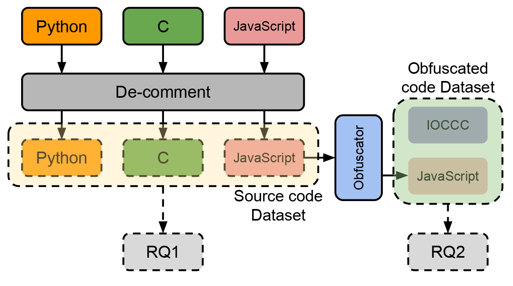
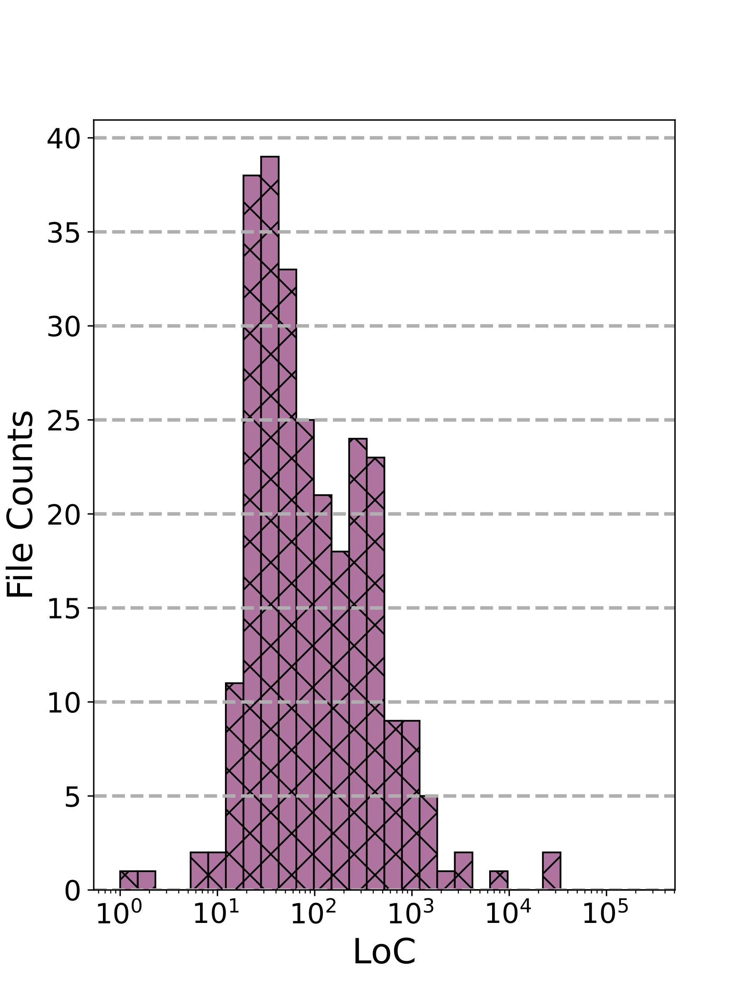
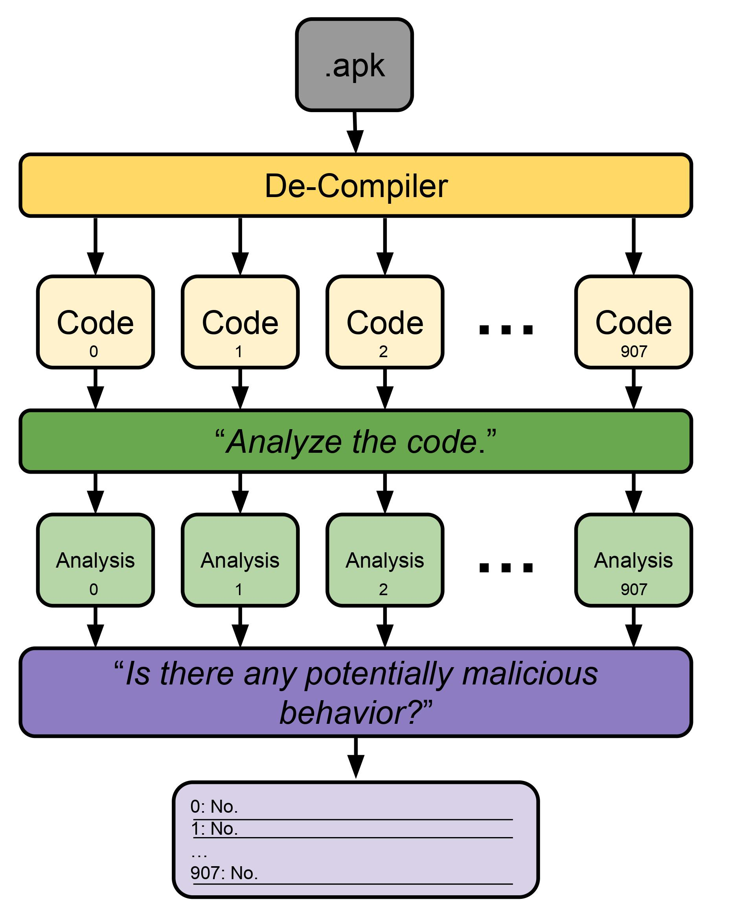
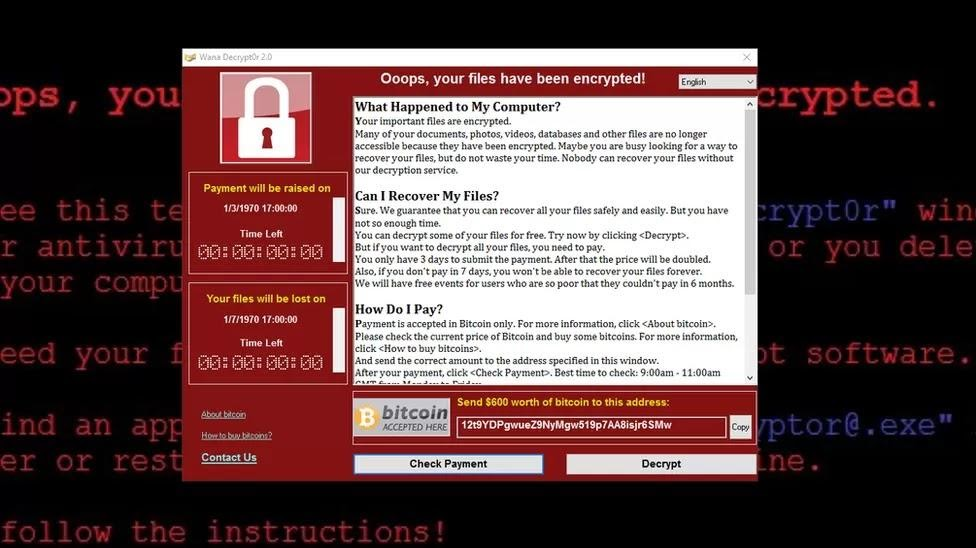

# llmsfor-code-analysis
## Introduction
This is the online appendix for our paper [Large Language Models for Code Analysis: Do LLMs Really Do Their Job?](https://arxiv.org/abs/2310.12357).
## Data

Our dataset consists of:
- Non-Obfuscated Code
1. C: Selected code sample from POJ-104 dataset and classic C benchmarks (Linpack, etc.);
2. JavaScript: The Octane benchmark and some web apps;
3. Python: Selected code samples from Google CodeSearchNet dataset;
- Obfuscated Code
1. Obfuscated JavaScript code (obtained by applying different obfuscation tchniques to the JavaScript branch of our Non-Obfuscated Code dataset);
2. Winner code of Internet Obfuscated C Code Contest (IOCCC);
## Results

Results of our analysis:
1. Responses of different models on different code sample
2. Statistics
## Case Studies

